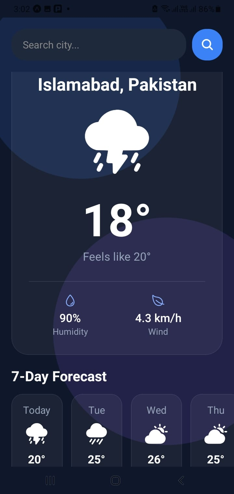
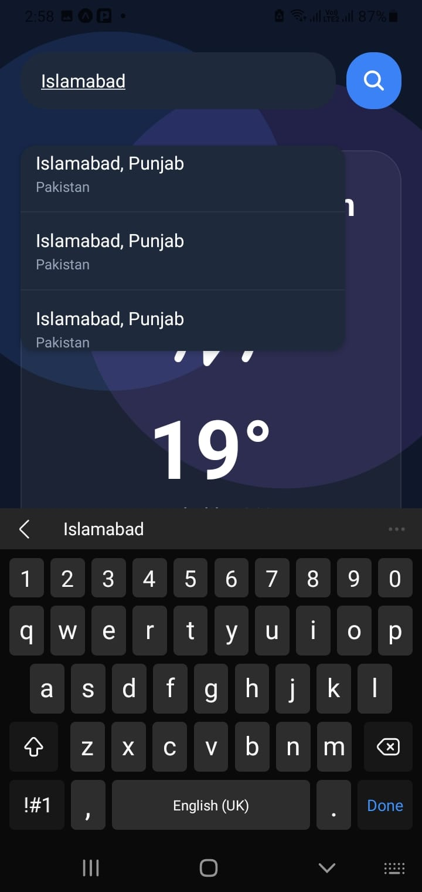

# 🌤️ WeatherApp (React Native)

A sleek, modern weather application built with React Native and Expo. It features a "glassmorphism" UI design, real-time location tracking, dynamic city search with autocomplete, and custom pure-code weather animations optimized to run smoothly at 60fps.

## ✨ Features

* **Real-Time Data:** Fetches live current weather and 7-day forecasts using the Open-Meteo API (no API key required).
* **Location-Aware:** Automatically detects the user's current city on startup using `expo-location` and reverse geocoding.
* **Smart Search:** Dynamic city search bar with real-time dropdown suggestions to prevent typing errors.
* **Ambient UI:** Features slow-moving, animated background orbs that utilize React Native's Native Driver to keep the JS thread free.
* **Pure-Code Animations:** Includes a highly optimized, multi-layered rain parallax effect built entirely with code (no heavy external image assets or GIFs).
* **Cross-Platform:** Styled with `react-native-safe-area-context` to ensure perfect rendering across iOS notches and Android status bars.

## 📱 Screenshots

*(Add your screenshots here! Take a screenshot on your phone and place them in an `assets/screenshots` folder)*

| Home Screen (Clear) | Search Suggestions |
| :---: | :---: | 
|  |  | 

## 🛠️ Tech Stack

* **Framework:** React Native (Expo)
* **Data Source:** [Open-Meteo API](https://open-meteo.com/) (Weather & Geocoding)
* **Icons:** `@expo/vector-icons` (Ionicons)
* **Location Services:** `expo-location`

## 🚀 Installation & Setup

To run this project locally, ensure you have Node.js installed, then follow these steps:

**1. Clone the repository**
```bash
git clone [https://github.com/shahryar-dev/WeatherApp.git](https://github.com/shahryar-dev/WeatherApp.git)